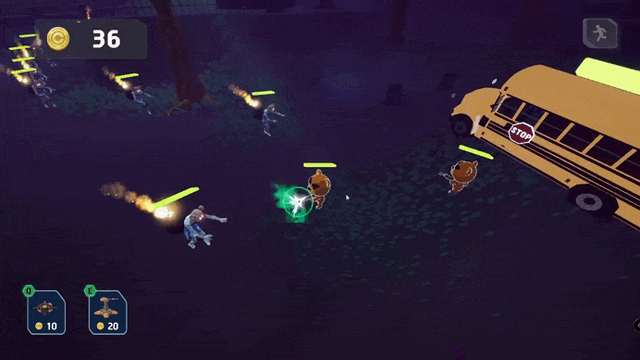
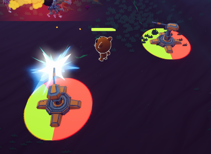
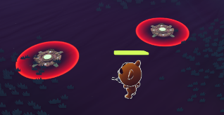
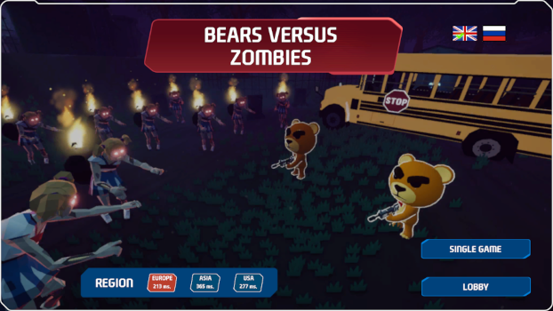
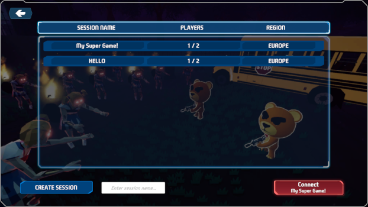
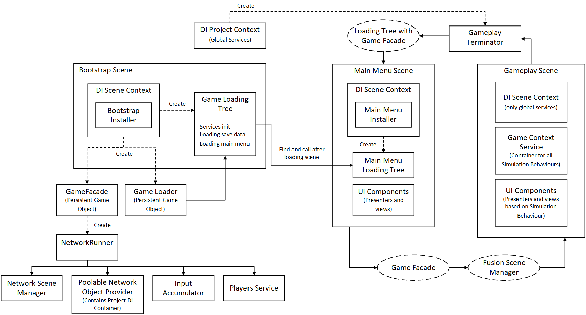

# BEARS VERSUS ZOMBIES

The objective of the game is to protect the school bus from waves of zombies and survive.

**Victory Conditions:**
- All zombies are eliminated
- All players survive
- The bus remains intact

Players can move around the map. The player’s character automatically targets the nearest enemy and opens fire on them.

For every enemy killed, players earn money. Money can be used to purchase mines or turrets.

A turret automatically targets enemies and fires at them. The turret has a limited lifespan and disappears after its time expires. 

A mine kills all enemies within a certain radius.

## Main Menu

In tha main menu you can choose either a single-player game or create a session for online multiplayer. In the main menu, you can select a region for online connection and set the language. 
The selected region and language settings are saved using the save manager.

In the lobby menu, you can either create a new session or join an existing one

## Technologies Used  

- Photon Fusion 2 (Host Mode)
- Addressables
- R3
- ZLinq
- A* Pathfinding Project Pro
- Magic Light Probes
- DOTween
- Animora UI Animation
- Odin Inspector/Validator
- I2 Localization

**AI and Movement:**  
- **Zombie AI:** Utilizes the FSM (Finite State Machine) addon and **A\* Pathfinding Project Pro** for pathfinding.  
- **Player Movement:** Powered by the **SimpleKCC** (Kinematic Character Controller) addon for smooth and responsive movement.

## Project Sctucture
The project structure follows a modular architecture. Independent modules that can be reused across different projects are located in the `Assets/Modules` folder.
The `Assets/Game/Scripts` folder contains the integration code that links the modules together, as well as project-specific code.
Sections directly related to the game project itself are located in the `Assets/Game` folder.

- Assets
  - Game
    - Configs
    - Input
    - Materials
    - Prefabs
    - Scripts
    - etc
  - Modules
    - Animation
    - AssetsManagement
    - etc

## Project Architecture

The game prototype is built entirely using a component-based approach without any DI frameworks.

This approach was chosen because the architecture of the Photon Fusion 2 framework relies on the use of NetworkBehaviour and SimulationBehaviour, which in turn inherit from MonoBehaviour. These types are tightly coupled with the framework’s network buffers and internal execution cycle.

To align with the framework’s architecture and pipeline, the component-based approach was adopted, as it is straightforward and easier to maintain compared to a mix of different paradigms.

That said, it is still possible to integrate any DI framework into the project if needed. A Service Locator is used as the tool for dependency injection in the project.

An implementation of an approach with minimal use of `MonoBehaviour` with Zenject can be found in my repository [Modular Unity Game Template](https://github.com/NintendaDev/modular-unity-game-template)

### Game Loader

Responsible for initializing the application, it is a `Don't Destroy On Load` object. Its child objects contain global services that are accessible throughout the entire game, such as the save system, localization system, Signal Bus, and others.

The Game Loader starts the loading tree operations, which initialize all global services, load data from the save system, and load and initialize the main menu scene.

### Game Facade

Responsible for various aspects of the game's interaction with the Photon Fusion 2 framework. Since Fusion 2 is a large and complex framework, the `GameFacade` was implemented as a single `partial` class for easier maintenance. 

Each part of the class handles a specific aspect of the interaction with Photon:

- GameFacade
  - GameFacade_AppSettings
  - GameFacade_Components
  - GameFacade_HostMigration
  - GameFacade_Lobby
  - GameFacade_Regions
  - GameFacade_Shutdown
  - GameFacede_Connection
  - GameFacede_Disconnect

### Service Locator

The Service Locator is unique to each scene and is initialized by the `SceneInitializer`. It retrieves global services from the GameLoader object, while local scene components are initialized via serialized fields in the SceneInitializer.

Scene components receive their dependencies from the Service Locator either through the `InitializeAsync` method or via the Photon callback `Spawned`.

### Scene Initializer

This component is responsible for initializing the Service Locator, as well as optionally initializing scene components.

In the main menu scene, after the Service Locator is initialized, the `InitializeAsync` method is called on required scene components in the correct sequence.

Within `InitializeAsync`, each component performs its setup and retrieves its dependencies from the Service Locator. This method is used only in the main menu, where no Photon session exists and its callbacks are not triggered.

In gameplay scenes, components receive their dependencies via the `Spawned` callback.

The `SceneInitializer` is executed before `Spawned` is called. This is achieved by modifying NetworkSceneManagerDefault into a custom `FusionSceneManager`.

During scene loading, before registering all NetworkBehaviour instances in the NetworkRunner, the scene is scanned for a `SceneInitializer` descendant, and its initialization is executed.

After that, SimulationBehaviour instances are located and registered in the NetworkRunner. This guarantees that the Service Locator is fully populated with dependencies before scene components are initialized.
